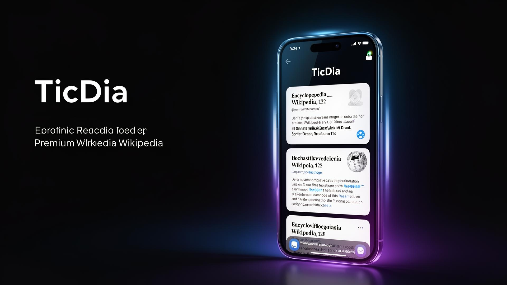
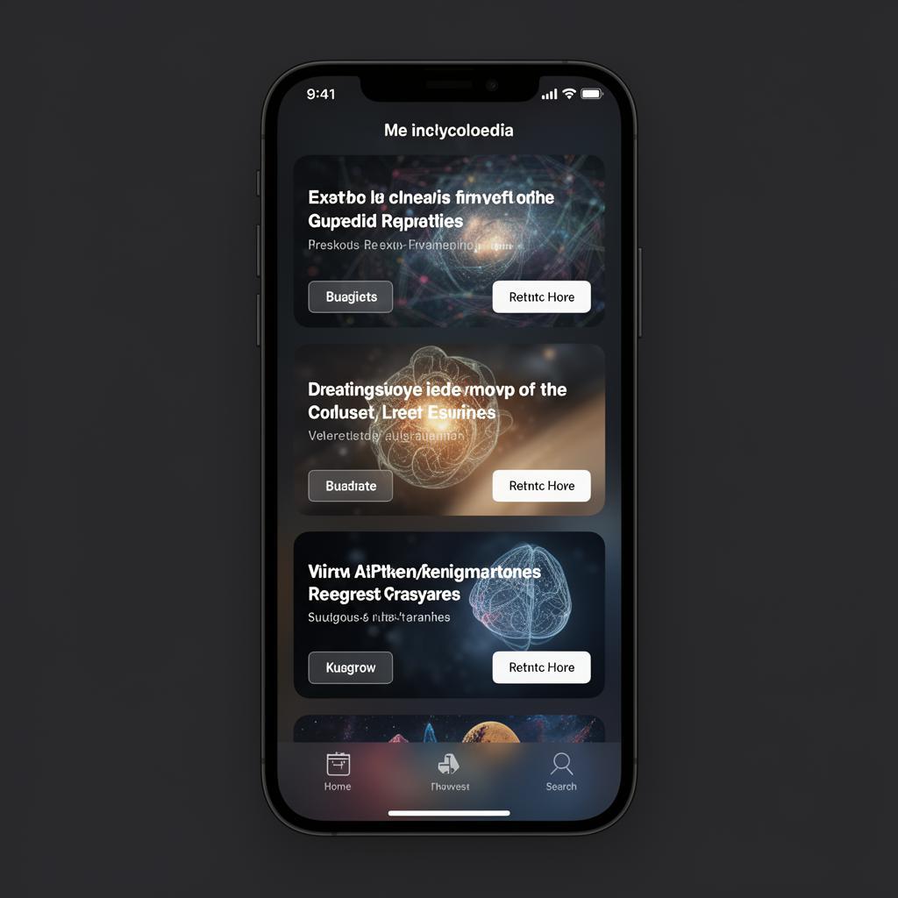
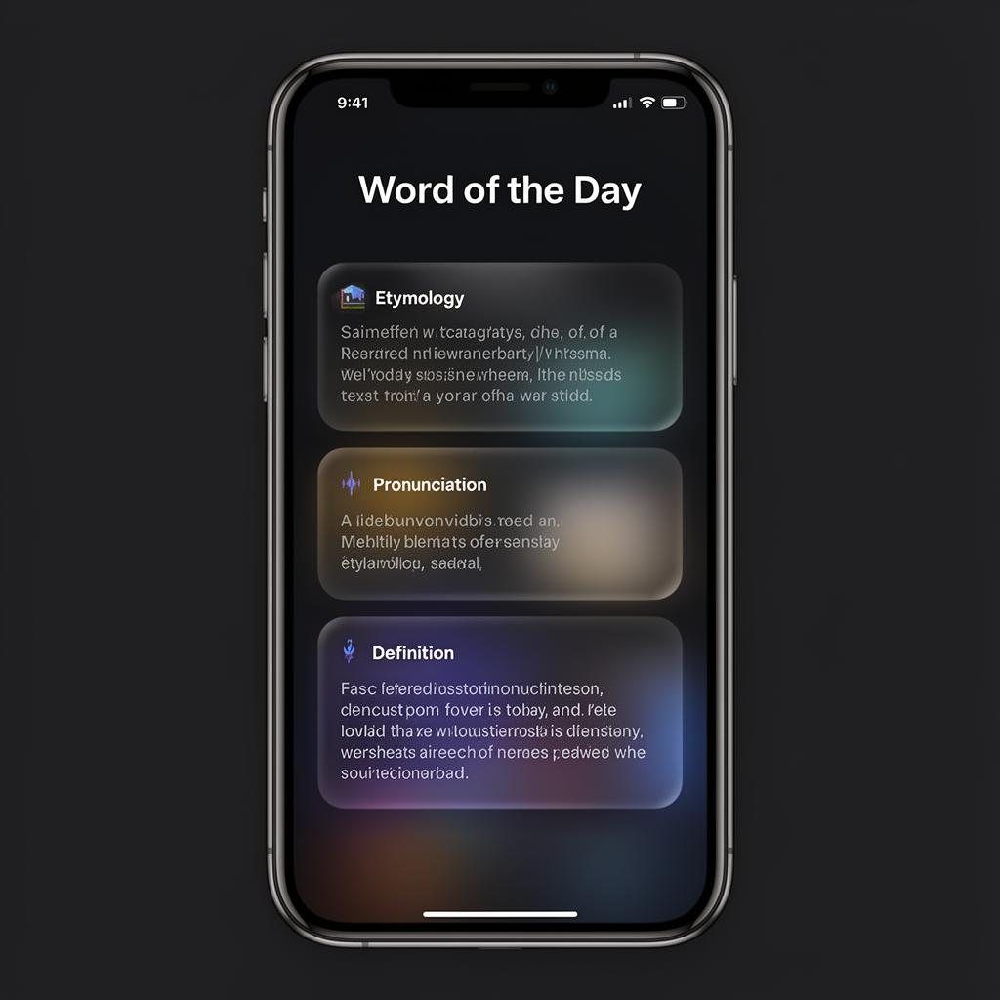
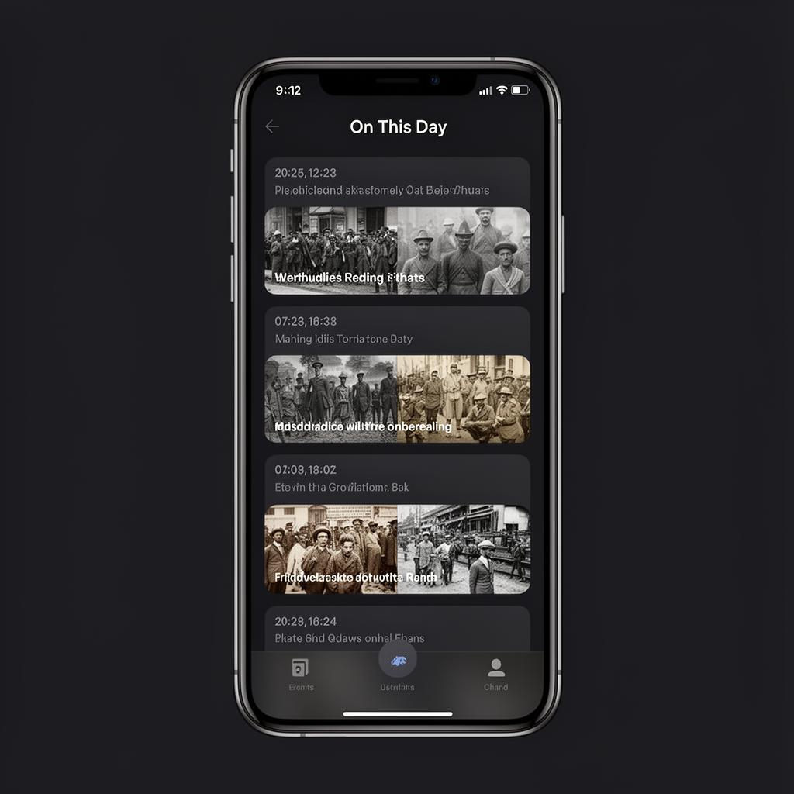

<p align="center">
  
</p>

<h1 align="center">TicDia</h1>

<p align="center">
  <strong>Wikipedia meets vertical scroll.</strong><br/>
  A full-screen, swipe-based encyclopedia built for curiosity.
</p>

<p align="center">
  <a href="https://ticdia.lovable.app/">Live App</a> &middot;
  <a href="#feeds">Feeds</a> &middot;
  <a href="#architecture">Architecture</a> &middot;
  <a href="#running-locally">Run Locally</a> &middot;
  <a href="#contributing">Contributing</a>
</p>

<p align="center">
  
  
  
  
  
  
</p>

---

## The Idea

TicDia transforms the world's largest encyclopedia into a feed you can't put down. Swipe through articles, historical events, surprising facts, and word etymologies the same way you'd scroll short-form video — but for knowledge.

No login required to start reading. Sign in to unlock personalization, streaks, badges, and saved articles.

---

## Screenshots

<p align="center">
  
  &nbsp;&nbsp;
  
  &nbsp;&nbsp;
  
</p>

<p align="center">
  <em>Left to right: Main Feed, Word of the Day, On This Day</em>
</p>

---

## Feeds

| Feed | Source | What you get |
|------|--------|--------------|
| **Main** | Wikipedia random + curated | Full immersive article cards with images, TTS, voting, and Smart Links |
| **Words** | Wiktionary + complexity engine | Etymology, usage, pronunciation — one interesting word at a time |
| **On This Day** | Wikipedia `/feed/onthisday` | Events, births, deaths with contextual relevance labels ("Born on this day, 87 years ago") |
| **Did You Know?** | Wikipedia summaries | Surprising facts with "Why it's interesting" context cards |

All feeds share vertical snap-scroll, background imagery with user-controlled opacity, glass-morphism cards, and smooth Framer Motion transitions.

---

## Key Features

**Multilingual** — 10 languages with full RTL support (Arabic included). Switch languages on the fly.

**Text-to-Speech** — ElevenLabs AI voices read articles aloud in your chosen language. Adjustable speed.

**Deep Personalization** — Fonts, highlight colors, text size, background opacity (per-feed granularity), dark/light themes.

**Contextual Relevance** — On This Day and Did You Know feeds explain *why* each entry matters today, with date-aware labels and "Why it matters" context sections.

**Smart Links** — Wikipedia internal links are extracted and displayed as interactive chips for rabbit-hole browsing.

**Word Complexity Highlighting** — Rare or complex words are highlighted inline. Tap for instant definitions via Wiktionary.

**Daily Challenges & Badges** — Gamified reading with achievement tracking, streaks, and community voting.

**Search** — Instant Wikipedia search with autocomplete suggestions and category browsing (Science, History, Technology, Arts, etc.).

**Progressive Web App** — Installable on any device with offline support.

---

## Architecture

```
src/
  components/       UI components (Navigation, ArticleViewer, Feeds, etc.)
  contexts/         React contexts (Auth, Theme, Language, UserPreferences)
  hooks/            Custom hooks (analytics, articles, challenges, gestures)
  pages/            Route-level pages (Index, Today, WordFeed, OnThisDayFeed, etc.)
  services/         API clients, data transformers, business logic
  utils/            Security, performance, error tracking utilities

supabase/
  functions/        Edge functions (TTS, translate, fetch-news, dictionary, etc.)
  migrations/       Database schema migrations
```

### Tech Stack

| Layer | Technology |
|-------|-----------|
| Frontend | React 19, TypeScript, Vite, Tailwind CSS |
| UI | shadcn/ui, Radix primitives, Framer Motion |
| Backend | Supabase (Auth, Postgres, Edge Functions, RLS) |
| TTS | ElevenLabs API via Edge Functions |
| Data | Wikipedia REST API, Wiktionary API |
| Hosting | Vercel (web), Capacitor (Android) |
| Analytics | Vercel Analytics, custom Supabase tracking |

### Data Flow

```
Wikipedia API  -->  articleTransformer  -->  React Query cache  -->  ArticleViewer
Wiktionary     -->  wiktionaryService  -->  WordDefinitionTooltip
ElevenLabs     -->  tts-stream (edge)  -->  AudioPlayer component
User actions   -->  Supabase DB        -->  Analytics / Preferences / Saved Articles
```

---

## Running Locally

```bash
# Clone
git clone https://github.com/YOUR_USERNAME/ticdia.git
cd ticdia

# Install
npm install

# Environment
cp .env.example .env
# Fill in your Supabase URL, anon key, and optional ElevenLabs key

# Dev server
npm run dev
```

The app runs at `http://localhost:5173`.

### Environment Variables

| Variable | Required | Description |
|----------|----------|-------------|
| `VITE_SUPABASE_URL` | Yes | Your Supabase project URL |
| `VITE_SUPABASE_ANON_KEY` | Yes | Supabase anonymous/public key |
| `ELEVENLABS_API_KEY` | No | ElevenLabs key for TTS (set in Supabase secrets) |

---

## Android

TicDia ships as a PWA but also supports native Android via Capacitor.

```bash
npm run build
npx cap add android
npx cap sync
npx cap open android
```

See [ANDROID_README.md](ANDROID_README.md) and [ANDROID_PLAYSTORE_GUIDE.md](ANDROID_PLAYSTORE_GUIDE.md) for full setup and Play Store submission instructions.

---

## Database

The Supabase schema includes:

- **user_preferences** — fonts, colors, opacity, TTS settings
- **saved_articles** — bookmarked articles per user
- **article_votes** — community voting system
- **user_analytics** — reading stats, streaks, scroll distance
- **daily_challenges** / **user_challenge_progress** — gamification
- **user_achievements** — badges and milestones
- **announcements** — admin-managed app announcements
- **content_moderation** / **content_rules** — moderation tools
- **feed_curation** — admin-curated featured articles
- **feature_flags** — gradual rollout controls
- **word_of_the_day** — daily word selection

All tables use Row Level Security. See [RUN_THIS_IN_SUPABASE.sql](RUN_THIS_IN_SUPABASE.sql) for the full schema.

---

## Edge Functions

| Function | Purpose |
|----------|---------|
| `text-to-speech` | ElevenLabs TTS generation |
| `tts-stream` | Streaming TTS for long articles |
| `translate` | Article translation via API |
| `dictionary-lookup` | Wiktionary definitions |
| `fetch-news` | External news feed aggregation |
| `rss-feed` | RSS parsing for curated sources |
| `explain-article` | AI-powered article summaries |
| `daily-article-selection` | Automated daily picks |

---

## Contributing

1. Fork the repo
2. Create a feature branch (`git checkout -b feat/my-feature`)
3. Commit your changes (`git commit -m "Add my feature"`)
4. Push and open a Pull Request

Please keep PRs focused. One feature or fix per PR.

---

## Security

- All API keys are stored as Supabase secrets or environment variables, never in client code
- Row Level Security on every table
- Content Security Policy headers configured
- Input sanitization via DOMPurify
- Rate limiting on edge functions

See [SECURITY_PERFORMANCE_REVIEW.md](SECURITY_PERFORMANCE_REVIEW.md) for the full audit.

---

## License

see licence tab.

---

<p align="center">
  Built with curiosity. Powered by Wikipedia's open knowledge.
</p>
